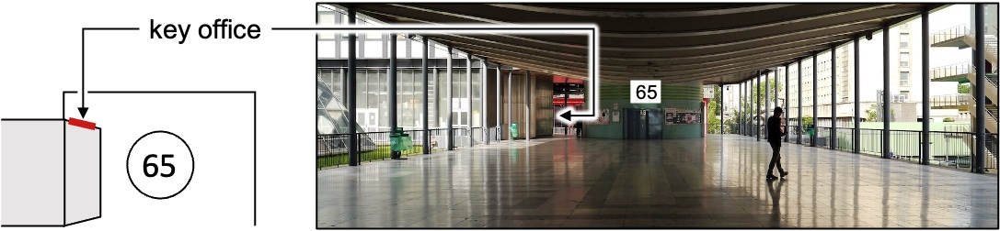

# IJLRA ([website](http://www.dalembert.upmc.fr))

## Your administrator

They will help you when you're lost. You'll find them at the 5th floor, corridor 44-54. Check which team you're in to know who to look for:

- Olivier Labbey (FCIH)
- Catherine Dejancourt (MISES)
- Sandrine Bandeira (LAM)
- Evelyne Mignon (CEPT et MPIA)

## Office and Key

- Ask your N+1 where is your office.

- Send a [mail to Olivier Labbey](mailto:labbey@dalembert.upmc.fr) asking if you can have a key.

- Upon notification that your key is ready:
    - (optional) Call the key office to check that they're open: `01 44 27 38 75`.
    - Go get your key, taking either ID card or passport with you.

## Email account

### D'Alembert account

Your primary email address, of the form `username@dalembert.upmc.fr`.

- Ask the IT department for a D'Alembert account
- Connect to the [online mail client](https://webmail.dalembert.upmc.fr/)

### Sorbonne account

A secondary email address that is useful to access University related services. Mails sent to this address will (should) automatically be redirected to your D'Alembert account.

- Once you have a D'Alembert email
- Send a [mail to Simona Otarasanu](mailto:simona.otarasanu@upmc.fr) or go and see her: corridor 44/54, 5th floor, office 510.

## Annuaire UPMC

@todo

## Email Clients

You'll need your [Annuaire UPMC](https://www.annuaire.upmc.fr/upmc/indexPage.upmc) account information to setup your email client. From there, setup with email client with:

- IMAP incoming mail server with the ID and password used to connect to d'Alembert [online mail client](https://webmail.dalembert.upmc.fr/), using `heywood.dalembert.upmc.fr` as host.

- SMTP outgoing mail server with your Annuaire UPMC ID and password, using `smtps.upmc.fr` as host.

Check the [D'Alembert Wiki](http://wiki.dalembert.upmc.fr/pmwiki/pmwiki.php?n=Dalembert.Messagerie#Comptes_dalembert.upmc.fr) for additional information.

## Printers

Follow instructions on the [d'Alembert Wiki](http://wiki.dalembert.upmc.fr/pmwiki/pmwiki.php?n=Dalembert.Imprimantes).

## Internet

### Wired

- Find your computer and/or internet hub **mac address**.

- Send a [mail to the IT department](mailto:info@dalembert.upmc.fr) or go and see them: corridor 55/65, 5th floor, office 507. Ask if your device can be enabled on the lab network.

### Wireless

Connect to `eduroam` with your Annuaire UPMC ID and password.

## Access ssh

- Create a public/private pair of ssh keys.
- Send a [mail to the IT department](mailto:info@dalembert.upmc.fr) asking if you can be granted access to the lab via ssh on `vauban.dalembert.upmc.fr` or `chagall.dalembert.upmc.fr`.

## Lab intranet

- Send a [mail to the IT department](mailto:info@dalembert.upmc.fr) asking for an intranet account.

## Room reservation

You'll need an access to the lab intranet

- Connect to the lab [room reservation service](http://www.dalembert.upmc.fr/grr/week_all.php?area=2) with your d'Alembert intranet ID and password.

## Crous (restaurant)

You'll need an account on the Annuaire UPMC to get an account at the university restaurant.

- Go to the Crous building (see map on home page) with your account ID and an ID card or passport.
- (optional) Install the [Izly app](https://www.izly.fr/) on your smartphone.

## Software

Check the [list of software](http://logiciels.upmc.fr/fr/index.html) distributed by Sorbonne University.